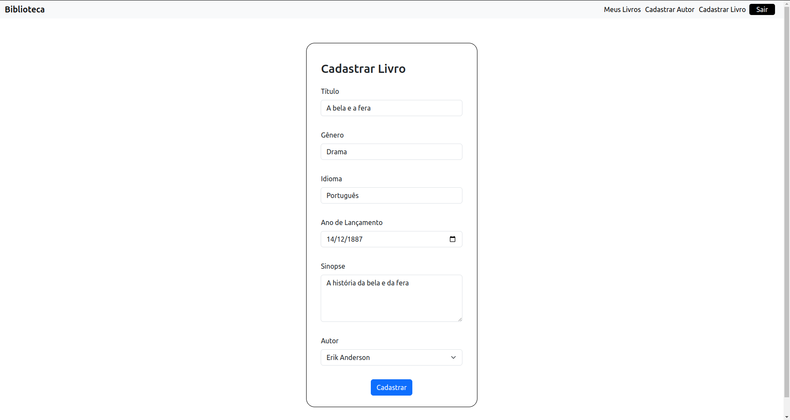

# Library App
# Sobre o projeto
Uma aplicação que representa um sistema de gerenciamento de um biblioteca, onde atende a criação e manutenção de livros, autores e usuários, contando com o desenvolvimento em formato fullstack com o intuito de contemplar todas as ações da aplicação.
## Funcionalidades
- [x] Cadastro de usuário;
- [x] Login e Logout;
- [x] Cadastro de Livro;
- [x] Cadastro de Autor;
- [x] Listagem de livros;
- [x] Manutenção de livros lidos e salvos por usuário.
## Layout
- Página de Login


- Cadastro de Usuário


- Meus Livros


- Cadastrar um Autor


- Cadastrar um Livro



- Detalhes do Livro


## Versões
```bash
# NodeJS 16.16.0
# Angular CLI: 14.0.7
# Package Manager: npm 8.11.0
# Redis: latest
```
## Como iniciar a aplicação?

### Método I: Execução de Scripts
1. Após a instalação do Angular CLI v14.0.7 e do Node v16.16.0 navegue até /library-app e execute o script "start.sh". O script será responsável por instalar as dependências do projeto e inicializar a aplicação Angular.

```bash
./start.sh
```
   
3. Com o Docker rodando na sua máquina navegue até /library-api e execute o script "start-api.sh". O script será responsável por realizar o download da imagem do Redis em sua máquina, instalar as depedências do projeto e inicializar a API.

```bash
./start-api.sh
```

### Método II: Manual
1. Após a instalação do Angular CLI v14.0.7 e do Node v16.16.0 navegue até /libray-app, na raiz onde encontra-se o package.json, e execute os comandos abaixo:
```bash
npm install
```
```bash
ng serve
```
2. Após a instalação do Node v16.16.0 navegue até /library-api/nestjs-api e execute os comandos abaixo:
```bash
npm install
```
Baixando imagem do Redis no Docker
```bash
docker run -d --name redis-stack -p 6379:6379 -p 8001:8001 redis/redis-stack:latest 
```
```bash
npm run start:dev
```
# Tecnologias utilizadas
1. [Angular](https://angular.io/)
2. [NestJS](https://nestjs.com/)
3. [Boostrap](https://getbootstrap.com/)
4. [uuidv-4](https://www.npmjs.com/package/uuidv4)
5. [Redis](https://redis.com/pt/)
6. [Docker](https://www.docker.com/)
# Autor
- [Erik Anderson](https://www.linkedin.com/in/erik-de-morais-740a44234/)
